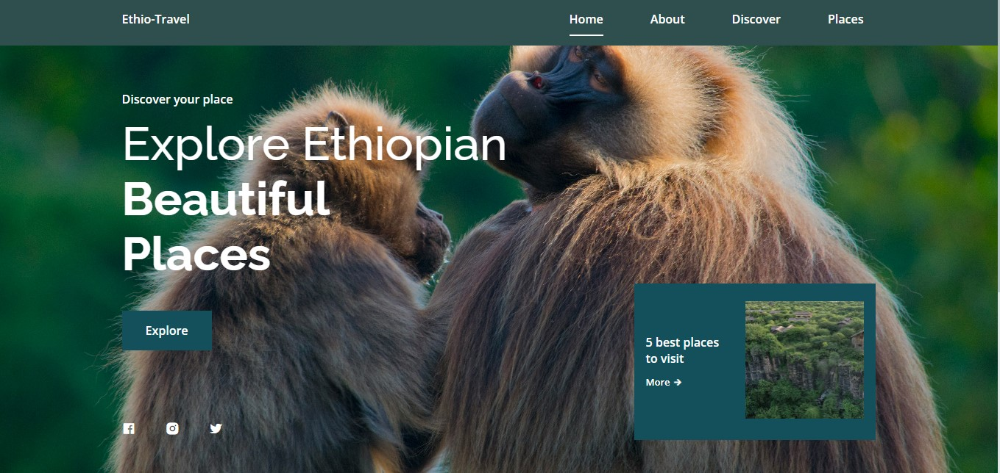

# <a href="https://ethiotravel.vercel.app">Ethio-Travel</a>

# Description
Ethio-Travel is a simple travel application use Maps to provide users with detailed travel information about the place. The application is built using HTML, CSS, SCSS for styling, Flask for the backend, and JavaScript for dynamic content and interactions.

# Features
- Route Planning: Get Information and Story about the Place.
- Destination Information: Get information about your destination, including attractions, restaurants, and accommodations.
- Weather Forecast: View weather forecasts for your travel dates to plan accordingly the Map.

# Technologies Used
- Frontend: HTML, CSS, SCSS
- Backend: Flask
- JavaScript: For dynamic content and interactions
- Google Maps: For route and location information.

# Access the Application
## <a href="https://ethiotravel.vercel.app">Click Here</a>

# Challenges and Future Improvements
- Performance Optimization: Improve the application's load time and responsiveness.
- User Interface Enhancements: Enhance the user interface with more interactive elements.
Additional Features: Implement features like travel tips, user reviews, and social sharing.
Proud Moments
Successfully integrating Google Maps for route and location.
Achieving a responsive and user-friendly design.
License
# Developers 
 ##  <a href="https://andoabza.vercel.app">Andamlak Abza</a>
 ;
 ##  <a href="https://github.com/Barniva">Barnabas Amede</a>
 ;
 
`This project is licensed under the MIT License. See the LICENSE file for details.`
